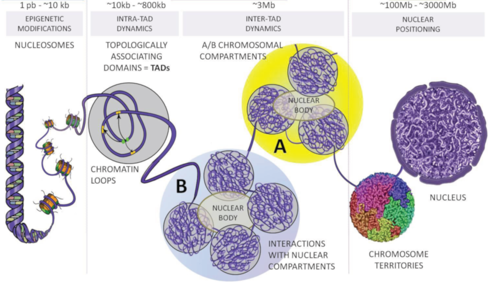
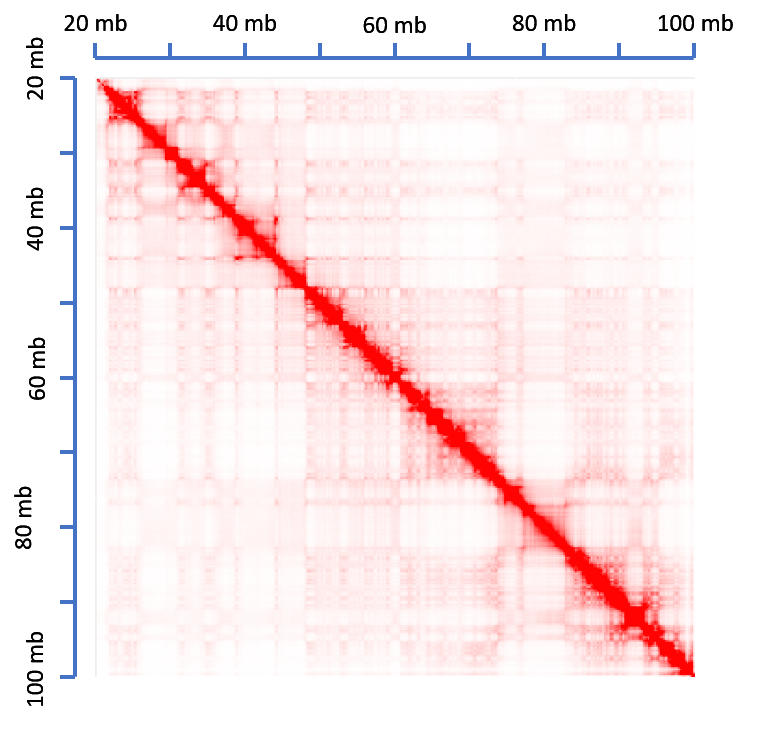
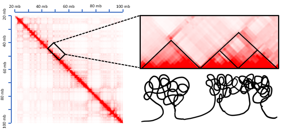
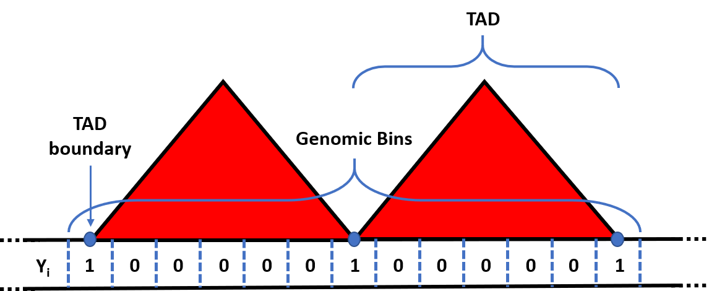
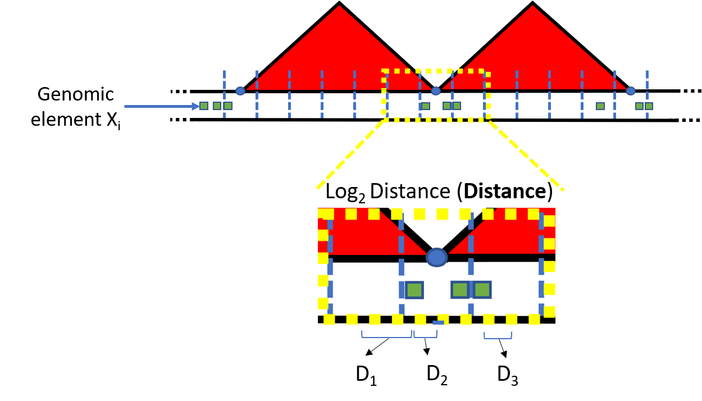
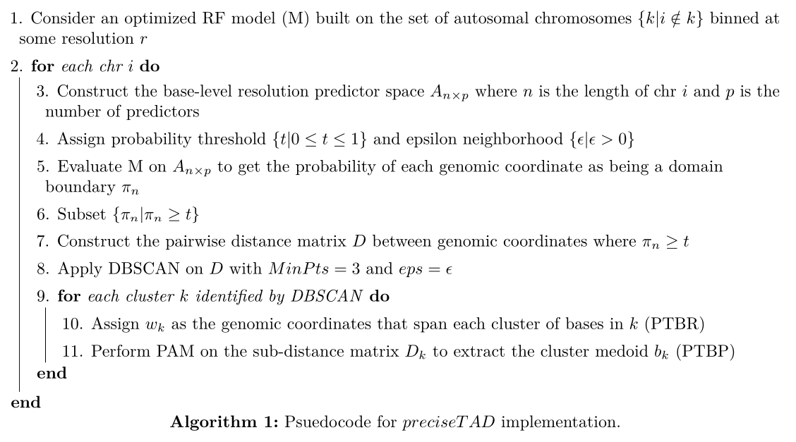

<!-- layout: true
  
<div class="my-footer">

</div>

--- -->

```{r xaringan-themer, include = FALSE}
library(xaringanthemer)
mono_light(
  base_color = "midnightblue",
  header_font_google = google_font("Josefin Sans"),
  text_font_google   = google_font("Montserrat", "500", "500i"),
  code_font_google   = google_font("Droid Mono"),
  link_color = "#8B1A1A", #firebrick4, "deepskyblue1"
  text_font_size = "28px"
)
```

## preciseTADworkshop resources

- [The slides](https://stilianoudakis.github.io/slides_preciseTADworkshop/#1): https://stilianoudakis.github.io/slides_preciseTADworkshop/#1

- [Github repo](https://github.com/dozmorovlab/preciseTADworkshop): https://github.com/dozmorovlab/preciseTADworkshop

- [Docker image](https://hub.docker.com/repository/docker/stilianoudakis/precisetadworkshop): https://hub.docker.com/repository/docker/stilianoudakis/precisetadworkshop

- [Pkgdown website](https://dozmorovlab.github.io/preciseTADworkshop/): https://dozmorovlab.github.io/preciseTADworkshop/

---

## The 3D structure of the genome

- .small[ Human genome is big - ~3.2 billion base pairs ]
- .small[ Chromosome structure and function is organized at multiple scales ]
- .small[ At kilobase (kb) scale chromatin loops form regions that are highly self-interacting called Topologically Associated Domains (TADs) ]

.center[]
---

## Why study TADs?

- TADs are stable and dynamic structures 
  + Highly conserved across species and cell lines
  + Associated with gene regulation

- Disruption of the boundaries that demarcate TADs has been shown to lead to rare diseases and even cancer

- Understanding the mechanisms through which TADs are formed remains a top priority in our goal to fully understand the functionality of the human genome

<!--- Can we leverage functional genomic elements in order to more precisely identify TAD boundaries?-->

---

##Hi-C data as a matrix

.pull-left[
- The genome (chromosome) is split into equally sized regions controlled by sequencing depth (resolution)

- Data is represented by a symmetric matrix of contacts $C_{ij}$ where entry $ij$ corresponds to the number of times region $i$ comes into contact with region $j$ (interaction frequency)

- Power-law decay of interactions with increasing **distance**
]

.pull-right[

]

---

## TAD-calling

.pull-left[
- “TAD-callers” have been proposed to identify the start and end coordinates of TAD boundaries

- Heavily reliant on Hi-C data “resolution”

- Ignore the fundamental role of functional genomic data (ChIP-seq data) in chromatin folding 

- Our aim: Can we leverage functional genomic elements in order to more precisely identify TAD boundaries?
]

.pull-right[

]

---

## Turning TAD calling into a supervised ML framework

.pull-left[ 
- Defining a resolution-specific response vector Y by shifted binning 
]

.pull-right[

]

---

## Turning TAD calling into a supervised ML framework

.pull-left[ 
- Defining the feature space $\textbf{X} = \{X_1, X_2, \cdots, X_p \}$
]

.pull-right[

]

---

## Precisely predicting TAD boundaries at base-level resolution using *preciseTAD*

What it does…
  + Leverages a predictive model in conjunction with:
  
    - Density-based spatial clustering of applications with noise (DBSCAN)
    - Partitioning around mediods (PAM)
    
  to precisely predict the most biologically meaningful chromosome-specific TAD boundaries

---

## Psuedocode

.center[]

---

## Evaluating precision of boundary prediction

- Enriched heatmaps

- Signal profile plots

- Distance to nearest ChIP-seq peak region

- Venn diagrams/Jaccard indices

---

## preciseTADworkshop resources

- [The slides](https://stilianoudakis.github.io/slides_preciseTADworkshop/#1): https://stilianoudakis.github.io/slides_preciseTADworkshop/#1

- [Github repo](https://github.com/dozmorovlab/preciseTADworkshop): https://github.com/dozmorovlab/preciseTADworkshop

- [Docker image](https://hub.docker.com/repository/docker/stilianoudakis/precisetadworkshop): https://hub.docker.com/repository/docker/stilianoudakis/precisetadworkshop

- [Pkgdown website](https://dozmorovlab.github.io/preciseTADworkshop/): https://dozmorovlab.github.io/preciseTADworkshop/

